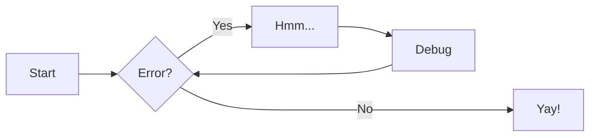
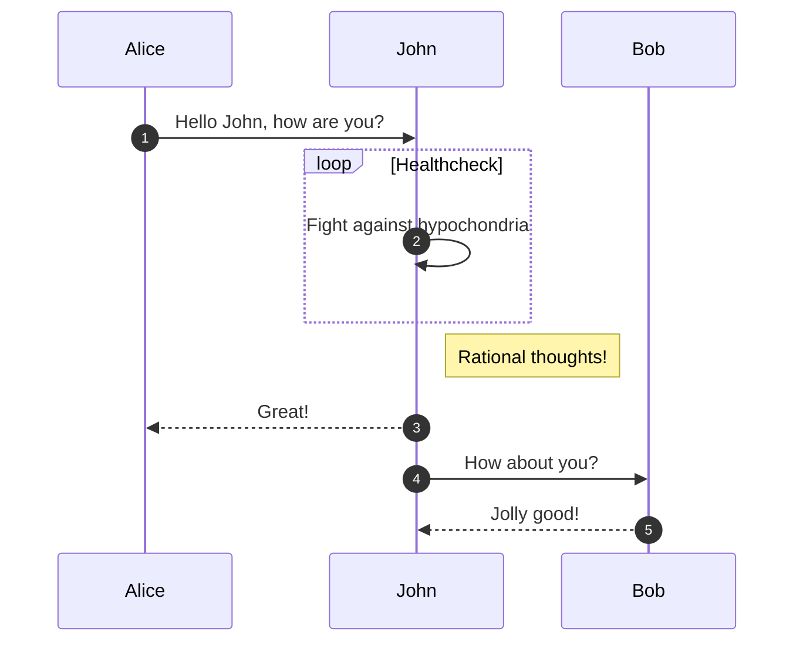
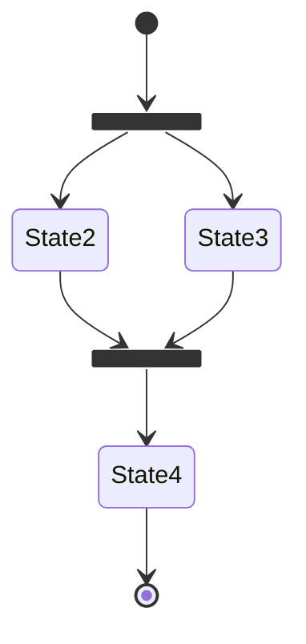
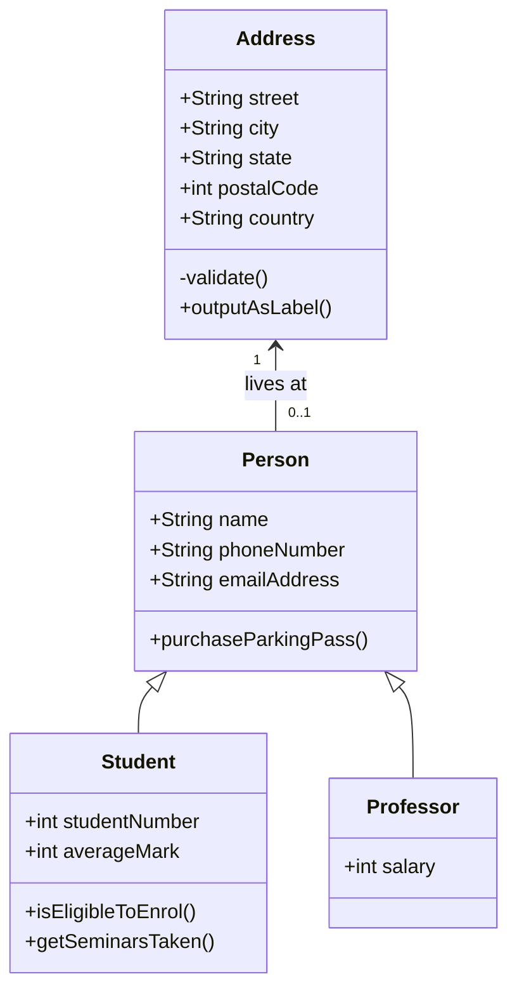
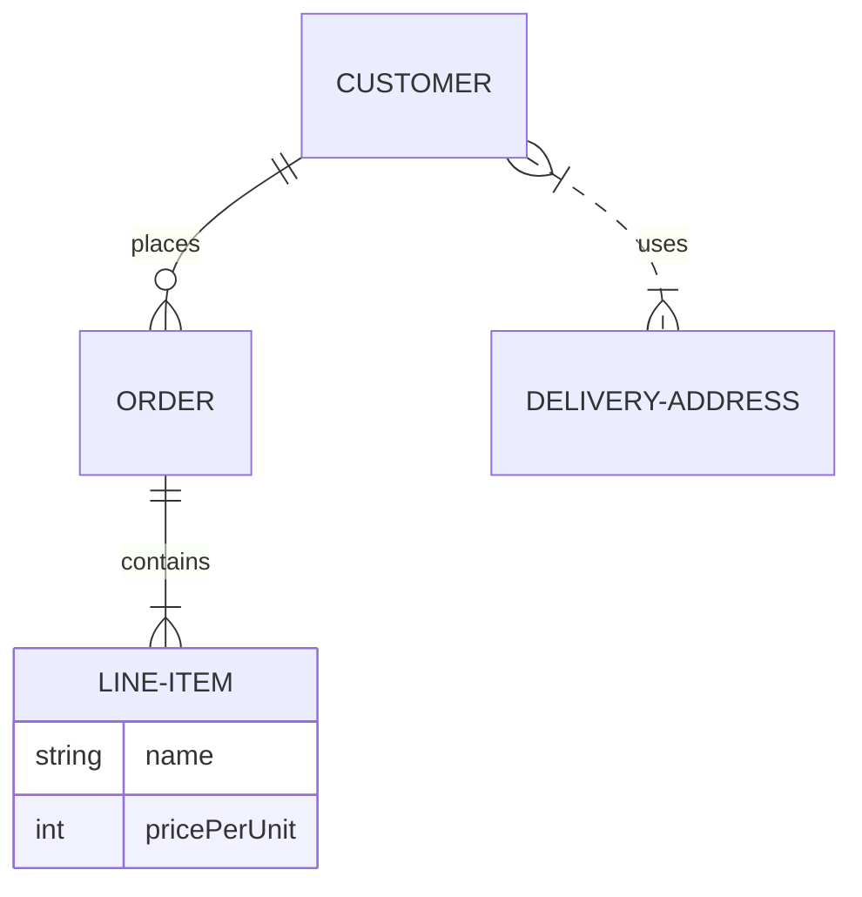

# 基础组件

## Admonitions

Admonitions 是一种用于显示信息的组件，通常用于提供提示、警告或其他重要信息。它们可以帮助用户更好地理解文档内容。

参考[ :simple-materialformkdocs: 官方教程](https://squidfunk.github.io/mkdocs-material/reference/admonitions/)来开启 Admonitions 功能。

### 基础样式

!!! note

    Lorem ipsum dolor sit amet, consectetur adipiscing elit. Nulla et euismod
    nulla. Curabitur feugiat, tortor non consequat finibus, justo purus auctor
    massa, nec semper lorem quam in massa.

!!! tip

### 无标题样式

!!! note ""

    Lorem ipsum dolor sit amet, consectetur adipiscing elit. Nulla et euismod
    nulla. Curabitur feugiat, tortor non consequat finibus, justo purus auctor
    massa, nec semper lorem quam in massa.

### 折叠样式

??? note

    Lorem ipsum dolor sit amet, consectetur adipiscing elit. Nulla et euismod
    nulla. Curabitur feugiat, tortor non consequat finibus, justo purus auctor
    massa, nec semper lorem quam in massa.

### 嵌套样式

!!! note "Outer Note"

    Lorem ipsum dolor sit amet, consectetur adipiscing elit. Nulla et euismod
    nulla. Curabitur feugiat, tortor non consequat finibus, justo purus auctor
    massa, nec semper lorem quam in massa.

    !!! note "Inner Note"

        Lorem ipsum dolor sit amet, consectetur adipiscing elit. Nulla et euismod
        nulla. Curabitur feugiat, tortor non consequat finibus, justo purus auctor
        massa, nec semper lorem quam in massa.

### 内置默认主题

!!! note

    Lorem ipsum dolor sit amet, consectetur adipiscing elit. Nulla et euismod
    nulla. Curabitur feugiat, tortor non consequat finibus, justo purus auctor
    massa, nec semper lorem quam in massa.

!!! Abstract

    Lorem ipsum dolor sit amet, consectetur adipiscing elit. Nulla et euismod
    nulla. Curabitur feugiat, tortor non consequat finibus, justo purus auctor
    massa, nec semper lorem quam in massa.

!!! Info

    Lorem ipsum dolor sit amet, consectetur adipiscing elit. Nulla et euismod
    nulla. Curabitur feugiat, tortor non consequat finibus, justo purus auctor
    massa, nec semper lorem quam in massa.

!!! Tip

    Lorem ipsum dolor sit amet, consectetur adipiscing elit. Nulla et euismod
    nulla. Curabitur feugiat, tortor non consequat finibus, justo purus auctor
    massa, nec semper lorem quam in massa.

!!! Success

    Lorem ipsum dolor sit amet, consectetur adipiscing elit. Nulla et euismod
    nulla. Curabitur feugiat, tortor non consequat finibus, justo purus auctor
    massa, nec semper lorem quam in massa.

!!! Question

    Lorem ipsum dolor sit amet, consectetur adipiscing elit. Nulla et euismod
    nulla. Curabitur feugiat, tortor non consequat finibus, justo purus auctor
    massa, nec semper lorem quam in massa.

!!! Warning

    Lorem ipsum dolor sit amet, consectetur adipiscing elit. Nulla et euismod
    nulla. Curabitur feugiat, tortor non consequat finibus, justo purus auctor
    massa, nec semper lorem quam in massa.

!!! Failure

    Lorem ipsum dolor sit amet, consectetur adipiscing elit. Nulla et euismod
    nulla. Curabitur feugiat, tortor non consequat finibus, justo purus auctor
    massa, nec semper lorem quam in massa.

!!! Danger

    Lorem ipsum dolor sit amet, consectetur adipiscing elit. Nulla et euismod
    nulla. Curabitur feugiat, tortor non consequat finibus, justo purus auctor
    massa, nec semper lorem quam in massa.

!!! Bug

    Lorem ipsum dolor sit amet, consectetur adipiscing elit. Nulla et euismod
    nulla. Curabitur feugiat, tortor non consequat finibus, justo purus auctor
    massa, nec semper lorem quam in massa.

!!! Example

    Lorem ipsum dolor sit amet, consectetur adipiscing elit. Nulla et euismod
    nulla. Curabitur feugiat, tortor non consequat finibus, justo purus auctor
    massa, nec semper lorem quam in massa.

!!! Quote

    Lorem ipsum dolor sit amet, consectetur adipiscing elit. Nulla et euismod
    nulla. Curabitur feugiat, tortor non consequat finibus, justo purus auctor
    massa, nec semper lorem quam in massa.

## Buttons

Buttons 是一种用于创建可点击的按钮的组件，通常用于触发某些操作或导航到其他页面。它们可以帮助用户更好地与文档进行交互。

参考[ :simple-materialformkdocs: 官方教程](https://squidfunk.github.io/mkdocs-material/reference/buttons/)来开启 Buttons 功能。

### 普通样式

[Subscribe to our newsletter](#){ .md-button }

[Subscribe to our newsletter](#){ .md-button .md-button--primary }

## Code blocks

Code blocks 是一种用于显示代码的组件，通常用于提供代码示例或其他技术信息。它们可以帮助用户更好地理解文档内容。

参考[ :simple-materialformkdocs: 官方教程](https://squidfunk.github.io/mkdocs-material/reference/code-blocks/)来开启 Code blocks 功能。

### 基础样式

```py title="bubble_sort.py"
def bubble_sort(items):
    for i in range(len(items)):
        for j in range(len(items) - 1 - i):
            if items[j] > items[j + 1]:
                items[j], items[j + 1] = items[j + 1], items[j]
```

```py linenums="1"
def bubble_sort(items):
    for i in range(len(items)):
        for j in range(len(items) - 1 - i):
            if items[j] > items[j + 1]:
                items[j], items[j + 1] = items[j + 1], items[j]
```

### 突出显示

```py hl_lines="1 3 5", linenums="1"
def bubble_sort(items):
    for i in range(len(items)):
        for j in range(len(items) - 1 - i):
            if items[j] > items[j + 1]:
                items[j], items[j + 1] = items[j + 1], items[j]
```

### 内联样式

The `#!python range()` function is used to generate a sequence of numbers.

### 注释

```yaml
theme:
    features:
        - content.code.annotate # (1)
```

1.  :man_raising_hand: I'm a code annotation! I can contain `code`, **formatted
    text**, images, ... basically anything that can be written in Markdown.

## Content tabs

Content tabs 是一种用于在同一页面上显示不同内容的组件，通常用于提供不同版本或不同语言的文档。它们可以帮助用户更好地浏览文档内容。

参考[ :simple-materialformkdocs: 官方教程](https://squidfunk.github.io/mkdocs-material/reference/content-tabs/)来开启 Content tabs 功能。

### 基础样式

=== "Unordered list"

    * Sed sagittis eleifend rutrum
    * Donec vitae suscipit est
    * Nulla tempor lobortis orci

=== "Ordered list"

    1. Sed sagittis eleifend rutrum
    2. Donec vitae suscipit est
    3. Nulla tempor lobortis orci

=== "C"

    ``` c
    #include <stdio.h>

    int main(void) {
      printf("Hello world!\n");
      return 0;
    }
    ```

=== "C++"

    ``` c++
    #include <iostream>

    int main(void) {
      std::cout << "Hello world!" << std::endl;
      return 0;
    }
    ```

### 嵌入样式

!!! example

    === "Unordered List"

        ``` markdown
        * Sed sagittis eleifend rutrum
        * Donec vitae suscipit est
        * Nulla tempor lobortis orci
        ```

    === "Ordered List"

        ``` markdown
        1. Sed sagittis eleifend rutrum
        2. Donec vitae suscipit est
        3. Nulla tempor lobortis orci
        ```

## Data tables

Data tables 是一种用于显示数据的组件，通常用于提供表格形式的数据。它们可以帮助用户更好地理解文档内容。

参考[ :simple-materialformkdocs: 官方教程](https://squidfunk.github.io/mkdocs-material/reference/buttons/)来开启 Data tables 功能。

### 基础样式

| Method   | Description                          |
| -------- | ------------------------------------ |
| `GET`    | :material-check: Fetch resource      |
| `PUT`    | :material-check-all: Update resource |
| `DELETE` | :material-close: Delete resource     |

## Diagrams

Diagrams 是一种用于显示图表的组件，通常用于提供数据可视化。它们可以帮助用户更好地理解文档内容。

参考[ :simple-materialformkdocs: 官方教程](https://squidfunk.github.io/mkdocs-material/reference/diagrams/)来开启 Diagrams 功能。

### 流程图



### 序列图



### 状态图



### 类图



### 实体关系图



## Footnotes

Footnotes 是一种用于显示脚注的组件，通常用于提供额外的信息或引用。它们可以帮助用户更好地理解文档内容。

参考[ :simple-materialformkdocs: 官方教程](https://squidfunk.github.io/mkdocs-material/reference/footnotes/)来开启 Footnotes 功能。

Lorem ipsum[^1] dolor sit amet, consectetur adipiscing elit.[^2]

[^1]: This is a footnote.
[^2]:
    Lorem ipsum dolor sit amet, consectetur adipiscing elit. Nulla et euismod
    nulla. Curabitur feugiat, tortor non consequat finibus, justo purus auctor
    massa, nec semper lorem quam in massa.

## Formatting

Formatting 是一种用于格式化文本的组件，通常用于提供不同样式的文本。它们可以帮助用户更好地理解文档内容。

参考[ :simple-materialformkdocs: 官方教程](https://squidfunk.github.io/mkdocs-material/reference/formatting/)来开启 Formatting 功能。

### 突出显示更改

Text can be {--deleted--} and replacement text {++added++}. This can also be
combined into {~~one~>a single~~} operation. {==Highlighting==} is also
possible {>>and comments can be added inline<<}.

{==

Formatting can also be applied to blocks by putting the opening and closing
tags on separate lines and adding new lines between the tags and the content.

==}

### 突出显示文本

-   ==This was marked (highlight)==
-   ^^This was inserted (underline)^^
-   ~~This was deleted (strikethrough)~~

### 下标和上标

-   H~2~O
-   A^T^A

### 键盘键

快捷键：++ctrl+alt+del+a++

## Grids

Grids 是一种用于创建网格布局的组件，通常用于提供不同布局的文档。它们可以帮助用户更好地浏览文档内容。

参考[ :simple-materialformkdocs: 官方教程](https://squidfunk.github.io/mkdocs-material/reference/grids/)来开启 Grids 功能。

### 基础样式

<div class="grid cards" markdown>

-   :fontawesome-brands-html5: **HTML** for content and structure
-   :fontawesome-brands-js: **JavaScript** for interactivity
-   :fontawesome-brands-css3: **CSS** for text running out of boxes
-   :fontawesome-brands-internet-explorer: **Internet Explorer** ... huh?

</div>

<div class="grid cards" markdown>

-   :material-clock-fast:{ .lg .middle } **Set up in 5 minutes**

    ***

    Install [`mkdocs-material`](#) with [`pip`](#) and get up
    and running in minutes

    [:octicons-arrow-right-24: Getting started](#)

-   :fontawesome-brands-markdown:{ .lg .middle } **It's just Markdown**

    ***

    Focus on your content and generate a responsive and searchable static site

    [:octicons-arrow-right-24: Reference](#)

-   :material-format-font:{ .lg .middle } **Made to measure**

    ***

    Change the colors, fonts, language, icons, logo and more with a few lines

    [:octicons-arrow-right-24: Customization](#)

-   :material-scale-balance:{ .lg .middle } **Open Source, MIT**

    ***

    Material for MkDocs is licensed under MIT and available on [GitHub]

    [:octicons-arrow-right-24: License](#)

</div>

<div class="grid" markdown>

:fontawesome-brands-html5: **HTML** for content and structure
{ .card }

:fontawesome-brands-js: **JavaScript** for interactivity
{ .card }

:fontawesome-brands-css3: **CSS** for text running out of boxes
{ .card }

> :fontawesome-brands-internet-explorer: **Internet Explorer** ... huh?

</div>

## Icons, Emojis

Icons 和 Emojis 是一种用于显示图标和表情符号的组件，通常用于提供视觉效果。它们可以帮助用户更好地理解文档内容。

参考[ :simple-materialformkdocs: 官方教程](https://squidfunk.github.io/mkdocs-material/reference/icons-emojis/)来开启 Icons 和 Emojis 功能。

### 基础样式

:smile:

:fontawesome-regular-face-laugh-wink:

## Images

Images 是一种用于显示图像的组件，通常用于提供视觉效果。它们可以帮助用户更好地理解文档内容。

参考[ :simple-materialformkdocs: 官方教程](https://squidfunk.github.io/mkdocs-material/reference/images/)来开启 Images 功能。


## Lists

Lists 是一种用于显示列表的组件，通常用于提供有序或无序的项目列表。它们可以帮助用户更好地理解文档内容。

参考[ :simple-materialformkdocs: 官方教程](https://squidfunk.github.io/mkdocs-material/reference/lists/)来开启 Lists 功能。

-   Nulla et rhoncus turpis. Mauris ultricies elementum leo. Duis efficitur
    accumsan nibh eu mattis. Vivamus tempus velit eros, porttitor placerat nibh
    lacinia sed. Aenean in finibus diam.

    -   Duis mollis est eget nibh volutpat, fermentum aliquet dui mollis.
    -   Nam vulputate tincidunt fringilla.
    -   Nullam dignissim ultrices urna non auctor.

## Math

Math 是一种用于显示数学公式的组件，通常用于提供数学表达式。它们可以帮助用户更好地理解文档内容。

参考[ :simple-materialformkdocs: 官方教程](https://squidfunk.github.io/mkdocs-material/reference/math/)来开启 Math 功能。

$$
\cos x=\sum_{k=0}^{\infty}\frac{(-1)^k}{(2k)!}x^{2k}
$$

## Tooltips

Tooltips 是一种用于显示工具提示的组件，通常用于提供额外的信息。它们可以帮助用户更好地理解文档内容。

参考[ :simple-materialformkdocs: 官方教程](https://squidfunk.github.io/mkdocs-material/reference/tooltips/)来开启 Tooltips 功能。

[Hover me](https://example.com "I'm a tooltip!")
